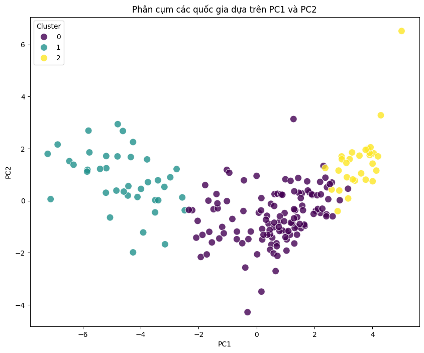

# Phân tích và Phân cụm Quốc gia (Clustering of Countries)

Dự án này áp dụng các kỹ thuật Học máy (Machine Learning) không giám sát để phân nhóm các quốc gia trên thế giới, dựa trên các chỉ số phát triển kinh tế - xã hội đựoc thu thập từ World Bank (World Development Indicators).

Mục tiêu là chia các quốc gia thành các nhóm có đặc điểm tương đồng (ví dụ: Kém phát triển, Đang phát triển, Phát triển) để hỗ trợ việc phân tích và ra quyết định.

## 📂 Cấu trúc dự án

- **`data/`**: Chứa các tập dữ liệu được sử dụng và tạo ra trong quá trình phân tích.
  - `WB_WDI_WIDEF.csv`, `clean_dataset.csv`: Dữ liệu gốc (WB_WDI_WIDEF.csv) được tải từ trang (https://data360.worldbank.org/en/dataset/WB_WDI?country=WLD) và dữ liệu sau khi làm sạch.
  - `*_result.csv`: Kết quả gán nhãn cụm từ các mô hình.
  - `wdi_pca_3.csv`: Dữ liệu sau khi giảm chiều bằng PCA.
- **`notebooks/`**: Các Jupyter Notebook chứa mã nguồn xử lý và mô hình hóa.
  - `clean_dataset.ipynb`: Tiền xử lý dữ liệu, làm sạch và giảm chiều dữ liệu (PCA).
  - `kmean_model.ipynb`: Phân cụm sử dụng thuật toán K-Means.
  - `hierarchical_model.ipynb`: Phân cụm sử dụng thuật toán Hierarchical Clustering.
  - `gmm_model.ipynb`: Phân cụm sử dụng thuật toán Gaussian Mixture Model (GMM).
- **`dashboard/`**: Chứa mã nguồn cho ứng dụng web trực quan hóa kết quả.
  - `app.py`: Ứng dụng Streamlit hiển thị biểu đồ và bản đồ phân cụm.

## ⚙️ Quy trình xử lý

1. **Thu thập & Làm sạch dữ liệu**: Xử lý các giá trị bị thiếu, chuẩn hóa dữ liệu.
2. **Giảm chiều dữ liệu (PCA)**: Áp dụng Principal Component Analysis để giảm số chiều của dữ liệu, giúp cải thiện hiệu suất mô hình và dễ dàng trực quan hóa.
3. **Xây dựng mô hình phân cụm**: Thử nghiệm và so sánh các thuật toán:
   - K-Means
   - Hierarchical Clustering
   - Gaussian Mixture Model (GMM)
4. **Đánh giá & Trực quan hóa**: Phân tích đặc điểm của từng cụm và hiển thị trên Dashboard.

## 📊 Phân loại nhóm quốc gia

Dựa trên kết quả phân tích, các quốc gia được chia thành 3 nhóm chính:
- **Nhóm 0**: Các quốc gia **Đang phát triển**.
- **Nhóm 1**: Các quốc gia **Kém phát triển**.
- **Nhóm 2**: Các quốc gia **Phát triển**.

## Kết quả phân loại với mô hình GMM


## 🚀 Hướng dẫn cài đặt và chạy Dashboard

### Yêu cầu hệ thống
- Python 3.7+

### Cài đặt thư viện
Cài đặt các thư viện cần thiết để chạy Dashboard:

```bash
pip install -r dashboard/requirements.txt
```

*Lưu ý: Để chạy các notebook trong thư mục `notebooks/`, bạn cần cài thêm các thư viện như `scikit-learn`, `matplotlib`, `seaborn`, `jupyter`.*

### Khởi chạy Dashboard
Để xem kết quả trực quan trên giao diện web, chạy lệnh sau từ thư mục gốc của dự án:

```bash
streamlit run dashboard/app.py
```

Dashboard sẽ cung cấp các biểu đồ tương tác và bản đồ thế giới thể hiện sự phân bố của các nhóm quốc gia.
